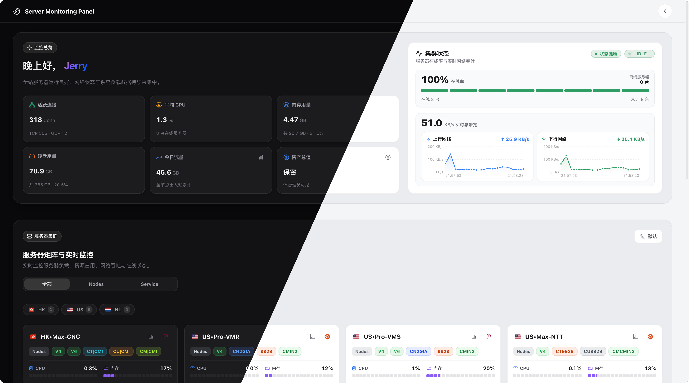

# Komari-Theme-SAO

> ⚠️ **声明：本项目为个人纯自用 / 定制二次开发分支。**  
> 如果您是在寻找或探索适用于 Komari 的主题，**强烈推荐前往并 Star 原作者的上游项目**：
> - 推荐上游分支：[shanyang242/Komari-Theme-LuminaPlus](https://github.com/shanyang242/Komari-Theme-LuminaPlus)
> - 推荐初代主题：[stqfdyr/komari-theme-Lumina](https://github.com/stqfdyr/komari-theme-Lumina)

---

## 🌲 项目渊源与族谱

本项目代码演进脉络如下：

```text
Komari 探针监控服务端 (komari-monitor/komari)
  └── komari-theme-Lumina (作者: @stqfdyr)
        └── Komari-Theme-LuminaPlus (作者: @shanyang242 / @shark)
              └── Komari-Theme-SAO (当前仓库: 个人自用定制分支)
```

1. **[Komari](https://github.com/komari-monitor/komari)**：底层探针监控服务端。
2. **[komari-theme-Lumina](https://github.com/stqfdyr/komari-theme-Lumina)**：原作者 `@stqfdyr` 设计并开源的优雅主题。
3. **[Komari-Theme-LuminaPlus](https://github.com/shanyang242/Komari-Theme-LuminaPlus)**：`@shanyang242` 基于 Lumina 深度重构的增强分支，新增了背景图/视频、透明度调节、首页总览文字评级、Ping/负载图表等诸多实用特性。
4. **[Komari-Theme-SAO](https://github.com/WAOR/Komari-Theme-SAO)**：本项目，基于 LuminaPlus 进行的个人二次开发与针对性优化分支。

---

## 🛠️ 本分支定制与优化内容

- **服务器价格与资产隐私保护机制**：
  - **访客价格公开设置**：在主题管理页面「07 花费」中新增「向访客公开价格与资产」配置项。未登录状态下默认隐藏所有节点价格标签，首页资产概览数值显示为 `**` 并隐藏资产评级标签与未登录跳转入口。
  - **右上角快捷显隐开关**：已登录用户在顶部悬浮工具栏中可通过眼睛图标（`Eye` / `EyeOff`）一键临时切换显示/隐藏节点价格与资产概览，方便日常截图、录屏与分享。
  - **全局价格联动与访问保护**：大卡、小卡、迷你卡、列表卡及临期弹窗在隐藏状态下直接隐藏价格标签；未登录访客直连 `/assets` 资产页时自动重定向回首页。
- **Radix UI Colors 官方色彩全量支持**：
  - 完整对齐并独立实现了 Radix 官方全套 30 种色彩体系（如 `Tomato`, `Red`, `Ruby`, `Crimson`, `Pink`, `Plum`, `Purple`, `Violet`, `Iris`, `Indigo`, `Blue`, `Cyan`, `Teal`, `Jade`, `Green`, `Grass`, `Lime`, `Mint`, `Sky`, `Amber`, `Yellow`, `Orange`, `Bronze`, `Gold`, `Brown`, `Gray`, `Mauve`, `Slate`, `Sage`, `Olive`, `Sand`）。
  - 彻底解决了原版中大量颜色被粗暴归并、颜色错位的问题。
  - 为浅色（Light）与深色（Dark）模式分别调校了专属色阶与对比度。
- **标签分隔符多格式兼容**：
  - 优化了节点标签的解析正则，同时兼容中英文分号与逗号（`;`、`,`、`；`、`，`），防止标签误粘连。
- **CI/CD 自动化构建优化**：
  - 配置了 GitHub Actions 自动编译与 Release 打包流，推送 Tag 即可一键生成 Release 安装包供 Komari 在线安装。

---

## 效果预览

<p align="center">
  
</p>

### 首页总览与节点卡片

首页总览包含文字评级，节点卡片同步优化流量额度、在线时长与布局密度；支持背景图、桌面视频与卡片透明度调节。

<p align="center">
  
</p>

<p align="center">
  
</p>

<p align="center">
  
</p>

<p align="center">
  
</p>

### 透明背景与视频背景

背景图、桌面视频与卡片透明度可在主题管理中配置，支持大卡片、小卡片和移动端布局。

<p align="center">
  
</p>

<p align="center">
  
</p>

---

## 💻 本地开发与预览

无需连接真实 Komari 后端也可以预览完整交互与所有色彩标签：

```bash
# 启动本地开发服务器
npm run dev

# 浏览器访问（包含丰富的 Radix 色彩 Mock 节点数据）
http://localhost:5173/?mock=1
```

---

## 💖 致谢

- 特别感谢 **[stqfdyr/komari-theme-Lumina](https://github.com/stqfdyr/komari-theme-Lumina)** 开源了初代 Lumina 主题。
- 特别感谢 **[shanyang242/Komari-Theme-LuminaPlus](https://github.com/shanyang242/Komari-Theme-LuminaPlus)** 的优秀工作与丰富功能扩展。
- 特别感谢 **[Montia37/komari-theme-purcarte](https://github.com/Montia37/komari-theme-purcarte)** 提供视频背景的设计思路与素材。
- 特别感谢 **[Komari](https://github.com/komari-monitor/komari)** 探针监控项目及社区开发者。

---

## 🔗 参考链接

- [Komari 官方仓库](https://github.com/komari-monitor/komari)
- [Komari 主题开发文档](https://komari-document.pages.dev/)
- [komari-theme-Lumina](https://github.com/stqfdyr/komari-theme-Lumina)
- [Komari-Theme-LuminaPlus](https://github.com/shanyang242/Komari-Theme-LuminaPlus)
- [Radix UI Colors 文档](https://www.radix-ui.com/themes/docs/theme/color)
